# 🚀 TeamFlow --- Sistema de Gestão de Equipes e Tarefas

## 🎥 Vídeo Pitch do Projeto

🎬 Pitch: https://youtu.be/-NOXLuM-K6M

------------------------------------------------------------------------

## 📌 Visão Geral

O **TeamFlow** é uma aplicação web desenvolvida utilizando a plataforma
**Bubble (No‑Code / Low‑Code)** com o objetivo de facilitar a gestão de
equipes e a organização de tarefas colaborativas.

A aplicação permite:

-   criação e gerenciamento de equipes
-   convite de novos membros
-   criação, edição e exclusão de tarefas
-   atribuição de tarefas a membros
-   notificações automáticas
-   controle de permissões por papel do usuário

O projeto demonstra como aplicações completas podem ser desenvolvidas
utilizando ferramentas **No‑Code**, mantendo arquitetura clara, controle
de acesso e fluxos automatizados.

------------------------------------------------------------------------

# ❗ Problema

Equipes frequentemente enfrentam dificuldades relacionadas à organização
do trabalho, como:

-   falta de visibilidade sobre tarefas
-   dificuldade em distribuir responsabilidades
-   ausência de notificações sobre novas tarefas
-   dificuldade em gerenciar membros da equipe
-   processos manuais de convite para novos integrantes

O **TeamFlow** resolve esses problemas centralizando o gerenciamento de
equipes e tarefas em uma única plataforma.

------------------------------------------------------------------------

# 🎯 Objetivo do Projeto

Desenvolver uma aplicação que permita:

-   organizar tarefas dentro de equipes
-   gerenciar membros da equipe
-   automatizar notificações de tarefas
-   controlar permissões de usuários
-   facilitar colaboração entre membros

------------------------------------------------------------------------

# 🛠 Tecnologias Utilizadas

  Tecnologia   Utilização
  ------------ ------------------------------
  Bubble       Desenvolvimento da aplicação
  GitHub       Documentação do projeto
  Markdown     Estrutura da documentação

📌 O **GitHub foi utilizado exclusivamente para documentação**, enquanto
toda a aplicação foi construída dentro do Bubble.

------------------------------------------------------------------------

# 👥 Sistema de Permissões

O sistema possui três papéis principais de usuário.

## 🧑‍💼 Gestor

Permissões:

-   criar equipes
-   editar equipes
-   excluir equipes
-   convidar membros
-   remover membros
-   visualizar convites enviados
-   criar tarefas
-   editar tarefas
-   excluir tarefas

------------------------------------------------------------------------

## 👨‍💻 Líder

Permissões:

-   editar equipes
-   convidar membros
-   remover membros
-   visualizar convites enviados
-   criar tarefas
-   editar tarefas
-   excluir tarefas

------------------------------------------------------------------------

## 👤 Membro

Permissões:

-   visualizar equipe atual
-   visualizar membros da equipe
-   criar tarefas
-   visualizar tarefas
-   editar tarefas
-   excluir tarefas
-   receber notificações

------------------------------------------------------------------------

# ⚙️ Funcionalidades da Aplicação

## Gestão de Usuários

-   cadastro de usuários
-   login
-   recuperação de senha
-   edição de perfil
-   alteração de senha
-   atualização de foto de perfil

------------------------------------------------------------------------

## Gestão de Equipes

Dependendo do papel do usuário:

Gestor: - criar equipe - editar equipe - excluir equipe

Gestor e Líder: - convidar membros - remover membros

Todos: - visualizar membros da equipe

------------------------------------------------------------------------

## Gestão de Tarefas

Usuários podem:

-   criar tarefas
-   editar tarefas
-   excluir tarefas
-   visualizar tarefas

Cada tarefa pode ser atribuída a **apenas um membro da equipe**.

Campos principais da tarefa:

-   título
-   descrição
-   prioridade
-   data de vencimento
-   responsável

------------------------------------------------------------------------

## Sistema de Convites

Novos membros entram na equipe através de **convites enviados por
e‑mail**.

Cada convite possui:

-   e‑mail do convidado
-   papel do usuário
-   equipe associada
-   token único
-   data de expiração
-   status do convite

------------------------------------------------------------------------

# 🔐 Validações Implementadas

Para garantir consistência e segurança do sistema, foram implementadas
validações como:

-   verificação se o link de convite é válido
-   verificação se o convite está expirado
-   verificação se o convite já foi aceito
-   bloqueio de convite para usuários que já possuem equipe
-   validação de senha e confirmação de senha
-   validação de campos obrigatórios

------------------------------------------------------------------------

# 🔔 Sistema de Notificações

Quando uma tarefa é atribuída a um usuário:

1.  o sistema cria um registro de **Notification**
2.  a notificação aparece no **Dashboard**
3.  o usuário pode marcar a notificação como **lida**

------------------------------------------------------------------------

# 🧠 Arquitetura do Sistema

## Fluxo Geral da Aplicação

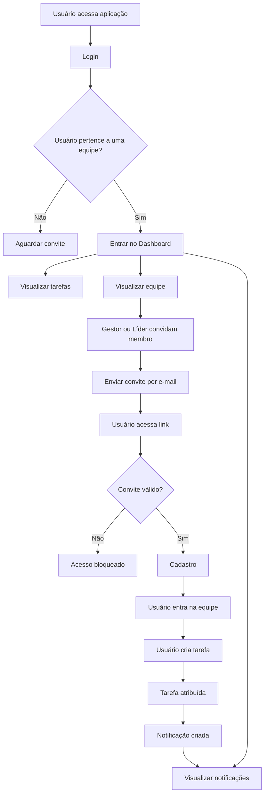

------------------------------------------------------------------------

# 🗄 Estrutura de Dados

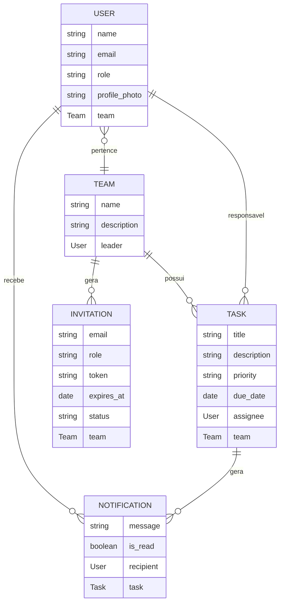

------------------------------------------------------------------------

# ⚙️ Explicação dos Workflows Principais

## Workflow: Criação de Tarefa

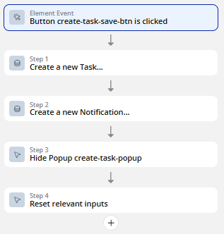

Fluxo:

1.  Usuário preenche formulário
2.  Sistema valida campos obrigatórios
3.  Bubble cria novo registro **Task**
4.  Se houver responsável definido:
5.  Sistema cria **Notification**

------------------------------------------------------------------------

## Workflow: Edição de Tarefa

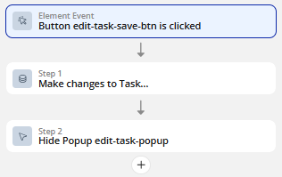

Fluxo:

1.  Sistema carrega dados da tarefa
2.  Usuário altera informações
3.  Workflow atualiza registro no banco

------------------------------------------------------------------------

## Workflow: Exclusão de Tarefa

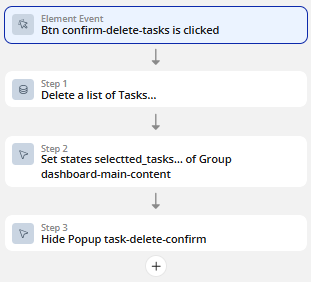

Fluxo:

1.  Usuário seleciona tarefa
2.  Sistema exibe popup de confirmação
3.  Bubble remove registro da base

------------------------------------------------------------------------

## Workflow: Convite para Equipe

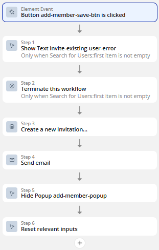

Fluxo:

1.  Gestor ou líder informa e-mail
2.  Sistema valida convite
3.  Bubble cria registro **Invitation**
4.  Sistema envia e-mail com token

------------------------------------------------------------------------

## Workflow: Cadastro via Convite

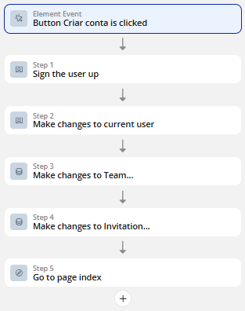

Fluxo:

1.  Usuário acessa link de convite
2.  Sistema lê token da URL
3.  Bubble valida convite
4.  Usuário cria conta
5.  Usuário entra na equipe

------------------------------------------------------------------------

## Workflow: Recuperação de Senha

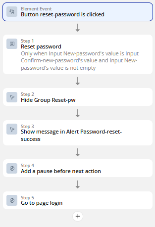

Fluxo:

1.  Usuário solicita redefinição
2.  Bubble envia e-mail seguro
3.  Usuário acessa link
4.  Sistema valida token
5.  Usuário define nova senha

------------------------------------------------------------------------

# 🖥 Interface da Aplicação

## Tela de Login

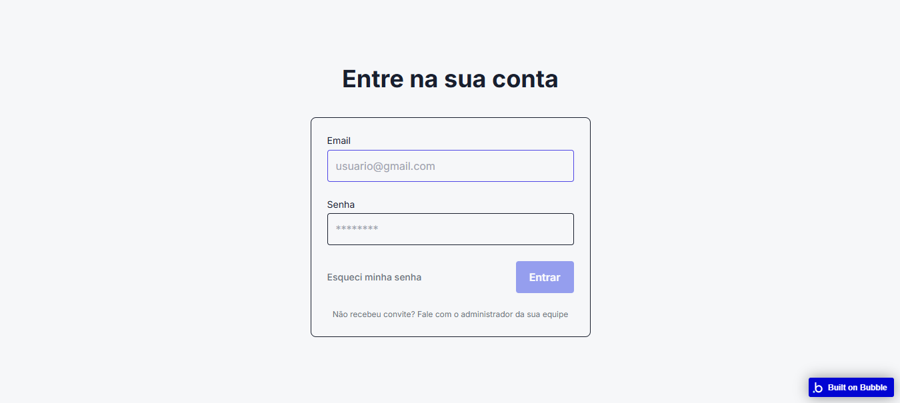

------------------------------------------------------------------------

## Tela de Cadastro

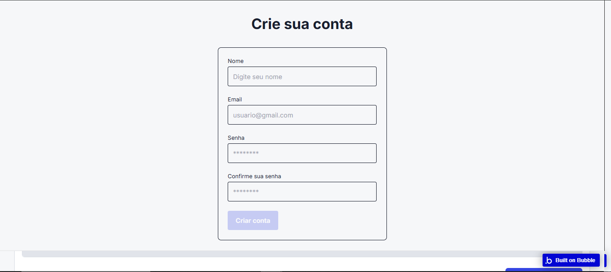

------------------------------------------------------------------------

## Recuperação de Senha

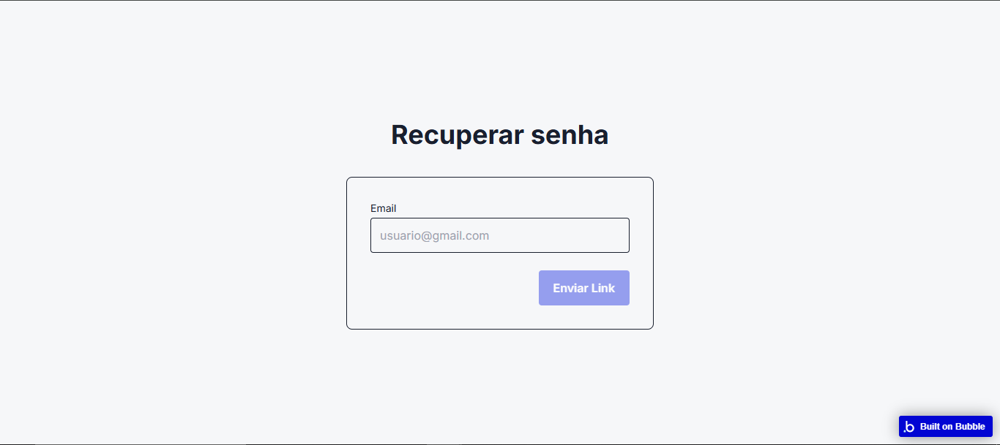

------------------------------------------------------------------------

## Dashboard

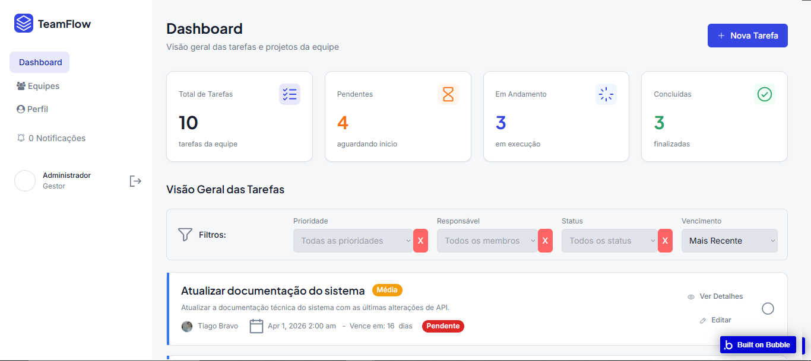

------------------------------------------------------------------------

## Tela Teams (Gerenciamento de Equipe)

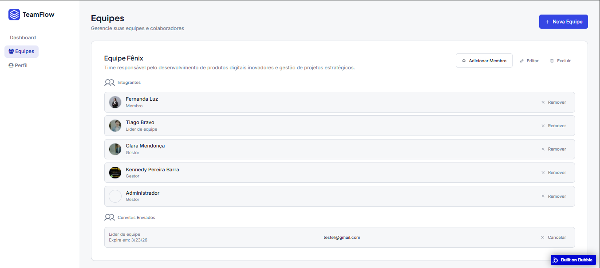

------------------------------------------------------------------------

## Tela Profile

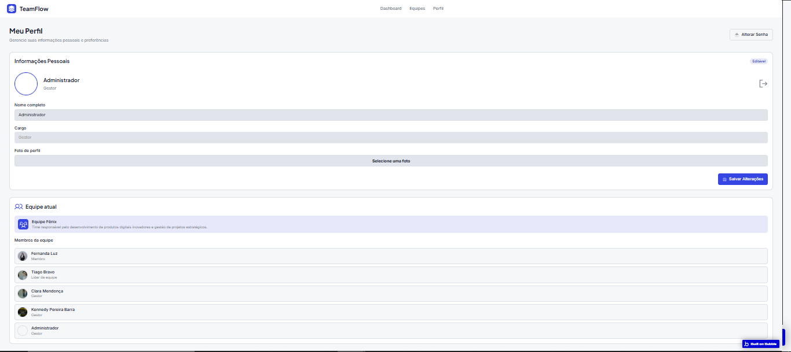

------------------------------------------------------------------------

# 🧪 Como Testar a Aplicação

## 1️⃣ Acessar a Aplicação

Abra a aplicação através do link abaixo:

🔗 **Link da aplicação**

Link: https://teamflow-26022.bubbleapps.io/version-test/login

------------------------------------------------------------------------

## 2️⃣ Login de Demonstração

Para facilitar a avaliação do sistema, um usuário administrador foi disponibilizado.

**Credenciais de acesso**

Email: teste@gmail.com

Senha: 123456

Esse usuário possui permissões de **Gestor**, permitindo testar todas as funcionalidades da aplicação.

------------------------------------------------------------------------

## 3️⃣ Testar Criação de Tarefas

1. Acesse o **Dashboard**.
2. Clique em **Criar tarefa**.
3. Preencha os campos obrigatórios:
   - título
   - descrição
   - prioridade
   - data de vencimento
   - responsável
4. Clique em **Salvar**.

Resultado esperado:

- A tarefa será criada.
- A tarefa aparecerá na lista de tarefas da equipe.
- Se houver um responsável definido, será criada uma **notificação para esse usuário**.

------------------------------------------------------------------------

## 4️⃣ Testar Edição de Tarefas

1. Acesse a lista de tarefas.
2. Clique em **Editar tarefa**.
3. Altere qualquer informação da tarefa.
4. Clique em **Salvar**.

Resultado esperado:

- A tarefa será atualizada no sistema.

------------------------------------------------------------------------

## 5️⃣ Testar Exclusão de Tarefas

1. Selecione uma ou mais tarefas.
2. Clique em **Excluir tarefa**.
3. Confirme a exclusão no popup.

Resultado esperado:

- A tarefa será removida da lista.

------------------------------------------------------------------------

## 6️⃣ Testar Convite para Membros

1. Acesse a aba **Teams**.
2. Clique em **Convidar membro**.
3. Informe:
   - e-mail do convidado
   - papel do usuário (líder ou membro)
4. Clique em **Enviar convite**.

Resultado esperado:

- Um convite será criado no sistema.
- O convite aparecerá na lista de **convites enviados**.

------------------------------------------------------------------------

## 7️⃣ Testar Cadastro via Convite

1. Utilize o e-mail convidado.
2. Abra o **link de convite recebido**.
3. A página de cadastro será aberta automaticamente.
4. Crie uma conta.

Resultado esperado:

- O usuário será automaticamente associado à equipe.

------------------------------------------------------------------------

## 8️⃣ Testar Recuperação de Senha

1. Na tela de login, clique em **Esqueci minha senha**.
2. Insira o e-mail do usuário.
3. Clique em **Enviar link de recuperação**.
4. Acesse o link enviado por e-mail.
5. Defina uma nova senha.

Resultado esperado:

- A senha do usuário será atualizada.

------------------------------------------------------------------------

## 9️⃣ Testar Notificações

1. Crie uma tarefa e atribua a um usuário.
2. Faça login com esse usuário.
3. Acesse o **Dashboard**.

Resultado esperado:

- Uma notificação aparecerá informando que uma nova tarefa foi atribuída.

O usuário também pode marcar a notificação como **lida**.

------------------------------------------------------------------------

## 🔟 Testar Permissões de Usuários

Para validar o sistema de permissões, recomenda-se criar usuários com diferentes papéis:

### Gestor
Pode:

- criar equipes
- editar equipes
- excluir equipes
- convidar membros
- remover membros

### Líder
Pode:

- editar equipe
- convidar membros
- remover membros

### Membro
Pode:

- visualizar equipe
- criar tarefas
- editar tarefas
- excluir tarefas

------------------------------------------------------------------------

## ✔️ Fluxos principais que podem ser testados

O avaliador pode validar os seguintes fluxos do sistema:

- cadastro de usuário
- login
- recuperação de senha
- criação de tarefas
- edição de tarefas
- exclusão de tarefas
- convite de membros
- cadastro via convite
- notificações no dashboard

------------------------------------------------------------------------

# 👨‍💻 Autor

Kennedy Pereira Barra

------------------------------------------------------------------------

# 📚 Observação

Projeto desenvolvido para fins acadêmicos utilizando **Bubble (No‑Code /
Low‑Code)**.
